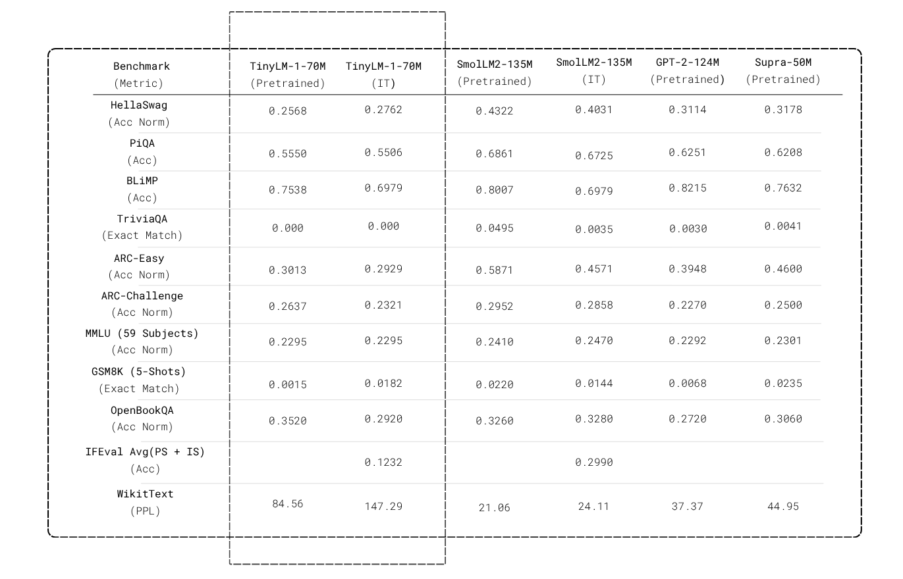

# TinyLM-1-70M: Deep-Dive Custom Transformer Framework

[](https://huggingface.co/Se00n00/TinyLM-1-70M)
[](#)
[](#)
[](#)
[](#)


TinyLM-1-70M is a compact decoder-only Transformer language model designed for efficient instruction following and conversational AI. The model has approximately 72M parameters and has been fine-tuned using Supervised Fine-Tuning (SFT) on an instruction-response dataset to improve chat capabilities while maintaining a lightweight footprint suitable for local inference and resource-constrained environments.

---

<em>All evaluations are zero-shot unless stated otherwise, and i used lm_eval to run them</em>

---

## Navigation Menu

- [Model Architecture Overview](#model-architecture-overview)
- [Model Evaluation](#model-evaluation)
- [Deep-Dive Algorithmic Mechanics](#deep-dive-algorithmic-mechanics)
- [Installation & Data Preparation](#installation--data-preparation)
- [3-Stage Pipeline](#the-3-stage-llm-pipeline)
- [Streaming Inference](#asynchronous-streaming-inference)

---

## Model Architecture Overview

TinyLM-1-70M leverages a pre-normalization architecture with gated feedforward networks and optional Mixture of Experts.

The schematic sequence mapping input text processing through the networks is illustrated below:

```
 [OUTPUT]
    │
    + ──────────┐
    |   ┌──────────────────────────┐  
    │   |        FEEDFORWARD       │
    │   └──────────────────────────┘
    |──[RMS-NORM]───┘
    + ──────────┐
    │   ┌──────────────────────────┐   
    │   |   MULTI-HEAD ATTENTION   │
    │   └──────────────────────────┘
    └──[RMS-NORM]───┘
    │
 [INPUT] + ──[LEARNED ENCODING]
```

---

## Model Evaluation

### Benchmark Comparison Results

All benchmark evaluations below were executed using `lm-evaluation-harness` (`lm-eval`). For every reference model listed, we evaluated them ourselves using `lm-eval` under identical evaluation conditions to ensure direct, fair, and reproducible comparison with **TinyLM-1-70M**.

#### 1. Pretrained Models Evaluation

Comparative zero-shot and few-shot evaluation results for pretrained base models:

| Category | Benchmark Task (Metric) | TinyLM-1-70M (Base, 70M) | GPT-2 (Base, 124M)* | Supra-50M (Base, 50M)* | SmolLM2-135M (Base, 135M)* |
| :--- | :--- | :---: | :---: | :---: | :---: |
| **Commonsense & Logic** | **HellaSwag** (AN*) | 0.2568 | 0.3114 | 0.3178 | **0.4322** |
| | **CommonsenseQA** (Acc*) | 0.1957 | 0.1957 | **0.1966** | 0.1933 |
| | **PiQA** (AN*) | 0.5550 | 0.6251 | 0.6208 | **0.6861** |
| | **Winogrande** (Acc*) | 0.5036 | 0.5162 | 0.5099 | **0.5304** |
| **Language Modeling** | **WikiText** (PPL* ↓) | 84.56 | 37.37 | 44.95 | **21.06** |
| **Linguistic & Syntax** | **BLiMP** (Acc*) | 0.7538 | **0.8215** | 0.7632 | 0.8007 |
| **Mathematical Reasoning** | **GSM8K** (5-shot, EM*) | 0.0015 | 0.0068 | **0.0235** | 0.0220 |
| **Open-Domain Fact Retrieval** | **TriviaQA** (EM*) | 0.0000 | 0.0030 | 0.0041 | **0.0495** |
| **Science & Domain Knowledge** | **ARC-Easy** (AN*) | 0.3013 | 0.3948 | 0.4600 | **0.5871** |
| | **ARC-Challenge** (AN*) | 0.2637 | 0.2270 | 0.2500 | **0.2952** |
| | **SciQ** (AN*) | 0.2310 | 0.6440 | 0.6810 | **0.7860** |
| | **OpenBookQA** (AN*) | **0.3520** | 0.2720 | 0.3060 | 0.3260 |
| | **MMLU** (57 subjects, Acc*) | 0.2295 | 0.2292 | 0.2301 | **0.2410** |

`* Short-form metric definitions:`
- **AN***: `acc_norm` (Length-normalized Accuracy)
- **Acc***: `acc` (Standard Raw Accuracy)
- **EM***: `exact_match` (Exact Match string accuracy)
- **PPL***: `word_perplexity` (Perplexity on test set; lower score indicates better language modeling)
- `*`: *Denotes reference models evaluated locally by us using `lm-eval`.*

---

#### 2. Instruction-Tuned Models Evaluation

Comparative evaluation results for instruction-fine-tuned (IFT) models:

| Category | Benchmark Task (Metric) | TinyLM-1-70M (Instruct, 70M) | SmolLM2-135M (Instruct, 135M)* |
| :--- | :--- | :---: | :---: |
| **Commonsense & Logic** | **HellaSwag** (AN*) | 0.2762 | **0.4031** |
| | **CommonsenseQA** (Acc*) | 0.1957 | **0.2105** |
| | **PiQA** (AN*) | 0.5506 | **0.6725** |
| | **Winogrande** (Acc*) | 0.5036 | **0.5280** |
| **Instruction Following** | **IFEval** (Acc*) | 0.1232 | **0.2990** |
| **Language Modeling** | **WikiText** (PPL* ↓) | 147.29 | **24.11** |
| **Linguistic & Syntax** | **BLiMP** (Acc*) | 0.6979 | **0.8039** |
| **Mathematical Reasoning** | **GSM8K** (5-shot, EM*) | **0.0182** | 0.0144 |
| **Open-Domain Fact Retrieval** | **TriviaQA** (EM*) | 0.0000 | **0.0035** |
| **Science & Domain Knowledge** | **ARC-Easy** (AN*) | 0.2929 | **0.4571** |
| | **ARC-Challenge** (AN*) | 0.2321 | **0.2858** |
| | **SciQ** (AN*) | 0.2260 | **0.6960** |
| | **OpenBookQA** (AN*) | 0.2920 | **0.3280** |
| | **MMLU** (57 subjects, Acc*) | 0.2295 | **0.2470** |

`* Short-form metric definitions:`
- **AN***: `acc_norm` (Length-normalized Accuracy)
- **Acc***: `acc` (Standard Raw Accuracy)
- **EM***: `exact_match` (Exact Match string accuracy)
- **PPL***: `word_perplexity` (Perplexity on test set; lower score indicates better language modeling)
- `*`: *Denotes reference models evaluated locally by us using `lm-eval` (IFEval for TinyLM-1-70M reflects prompt strict: `0.0832`, inst strict: `0.1631`, avg: `0.1232`; SmolLM2-135M-Instruct IFEval avg: `0.2990`).*

Evaluation details and full raw output predictions are saved under the [Evaluation/](file:///run/media/se00n00/P/LittleParrot/GPT/Evaluation) directory.

---

## Deep-Dive Algorithmic Mechanics

Below is the integrated breakdown of each constituent layer, combining mathematical formulations, algorithmic pseudocode, and inline code location links.

### 1. Learned Embeddings — [`EmbeddingLayer`](https://github.com/Se00n00/GPT/blob/main/model.py#L122)

Combines token identities with absolute learned position encoding to form continuous representations via [`EmbeddingLayer`](https://github.com/Se00n00/GPT/blob/main/model.py#L122).

#### Mathematical Formulation
$$\text{Embedding}(X) = E(X) + P(\text{Positions})$$

Where $E \in \mathbb{R}^{\text{Vocab} \times D}$ is the token embedding matrix and $P \in \mathbb{R}^{\text{MaxSeqLen} \times D}$ is the spatial positional matrix.

#### Algorithmic Pseudocode
```python
LearnedEmbedding(X:[B, L]): --> [B, L, D]
  Require: 
    E: [VOCAB_SIZE, D] # Embedding Matrix
    P: [MAX_LEN, D] # Position Matrix
  
  Steps:
    I = [0, 1, ..., L-1]
    X_pos = P[I] # X_pos: [L, D]
    X_tok = E[X] # X_emb: [B, L, D]
    
    return X_pos + X_tok
```

---

### 2. Normalization Layers — [`RMSNorm`](https://github.com/Se00n00/GPT/blob/main/model.py#L36)

Performs scale-normalization on layer inputs. The model uses [`RMSNorm`](https://github.com/Se00n00/GPT/blob/main/model.py#L36) (with standard [`LayerNorm`](https://github.com/Se00n00/GPT/blob/main/model.py#L25) also available) to omit the mean-centering step for faster training throughput:

#### Mathematical Formulation
$$\text{RMSNorm}(X) = \frac{X}{\sqrt{\frac{1}{d} \sum_{i=1}^d X_i^2 + \epsilon}} \odot W$$

Where $W \in \mathbb{R}^D$ is the learnable scaling parameter.

#### Algorithmic Pseudocode
```python
RMSNorm(X:[B, L, D]):  --> [B, L, D]
  Require: 
    y: [D]
  
  Steps:
    rms = sqrt(mean(X**2 + e, dim=-1)/D)
    X^ = X / rms
    
    return x^ @ y  # y:[D] --> [B, l, D] Broadcasting across seq length and batches
```

---

### 3. Causal Multi-Head Attention — [`Attention`](https://github.com/Se00n00/GPT/blob/main/model.py#L72)

Allows tokens to query and incorporate information from preceding tokens via [`Attention`](https://github.com/Se00n00/GPT/blob/main/model.py#L72).

#### Mathematical Formulation
$$Q = X W_Q, \quad K = X W_K, \quad V = X W_V$$

$$\text{Attention}(Q, K, V) = \text{softmax}\left(\frac{Q K^T}{\sqrt{d_{\text{head}}}} + M\right) V$$

$$\text{MHA}(X) = \text{Attention}(Q, K, V) W_O$$

Where $M_{ij} = 0 \text{ if } j \le i \text{ else } -\infty$ masks out future tokens to preserve causal autoregression.

#### Algorithmic Pseudocode
```python
Multi_Head_Attention(X:[B, L, D]): --> [B, L, D]
  Require: 
    W_Q: [D, D] # Query Matrix
    W_K: [D, D] # Key Matrix
    W_V: [D, D] # Key Matrix
    W_O: [D, D] # Key Matrix
  
  Steps:
    Q = W_Q @ X
    K = W_K @ X
    V = W_V @ X
    
    for n in Num_heads:
        Scores = softmax((Qn@Kn.T)/sqrt(Dn) + M) # [B, L, L]
        #                   -- Here M is causal mask :[L, L] where Mij = 0 if j<=(L-i) else -inf
        Values = Scores @ Vn # [B, L, Dn]
    Attention = Values.concat()
    
    return Attention @ W_O
```

---

### 4. Gated FeedForward (SwiGLU) — [`FeedForward`](https://github.com/Se00n00/GPT/blob/main/model.py#L48)

Projects representation dimensions up, applies gating logic, and projects back down using [`FeedForward`](https://github.com/Se00n00/GPT/blob/main/model.py#L48).

#### Mathematical Formulation
$$\text{FFN}_{\text{gated}}(X) = \text{Dropout}\Big( \big(\text{SiLU}(X W_{\text{up}}) \odot (X W_{\text{gate}}) \big) W_{\text{down}} \Big)$$

#### Algorithmic Pseudocode
```python
FeedForward(X:[B, L, D]): --> [B, L, D]
  Require: 
    Wup: [D, D_H] # Up Matrix
    Wgate: [D, D_H] # Gate Matrix
    Wdown: [D_H, D] # Down Matrix
  
  Steps:
    temp = SiLU(Wup @ X) * Wgate @ X
    y = Wdown @ temp

    return temp
```

---

### 5. Transformer Block — [`Block`](https://github.com/Se00n00/GPT/blob/main/model.py#L134)

Combines Attention, FeedForward, Normalization, and Residual connections into a single pre-normalized layer block via [`Block`](https://github.com/Se00n00/GPT/blob/main/model.py#L134).

#### Mathematical Formulation
$$X_1 = X + \text{Attention}(\text{RMSNorm}(X))$$

$$X_2 = X_1 + \text{FeedForward}(\text{RMSNorm}(X_1))$$

#### Algorithmic Pseudocode
```python
Block(X:[B, L, D]): --> [B, L, D]
  Steps:
    X = X + Attention(LayerNorm(X)) # Pre-normalization
    X = X + FeedForward(LayerNorm(X))

    return X
```

---

### 6. Consolidated Model — [`Model`](https://github.com/Se00n00/GPT/blob/main/model.py#L149)

Stacks multiple blocks sequentially and projects the final output representations back to the vocabulary dimension via [`Model`](https://github.com/Se00n00/GPT/blob/main/model.py#L149).

#### Mathematical Formulation
$$X_0 = \text{Embedding}(X)$$

$$X_k = \text{Block}_k(X_{k-1}), \quad \text{for } k=1, \dots, N_{\text{layers}}$$

$$\text{Output} = X_N W_{\text{head}}$$

#### Algorithmic Pseudocode
```python
Model(X:[B, L]): --> [B, L, D]
  Require:
    W_head: [D, VOCAB_SIZE]
    
  Initialization:
    Model.layers = normal_distribution(layers.weight, mean=0, std=0.02)
    
  Steps:
    X = LearnedEmbedding(X)
    for block in Blocks*Num_Layers:
      X = block(X)
    
    output = W_head(X)
    return output
```

---

### 7. Mixture of Experts (MoE) — [`MoE`](https://github.com/Se00n00/GPT/blob/main/Model/layers.py#L137)

Directs tokens dynamically to expert FFN subnetworks to scale model parameters while maintaining active compute efficiency via [`MoE`](https://github.com/Se00n00/GPT/blob/main/Model/layers.py#L137) (experimental).

#### Mathematical Formulation
$$\text{Router}(X) = \text{softmax}(\text{TopK}(X W_{\text{expert\_gate}}, k))$$

$$\text{MoE}(X) = \sum_{i \in \text{TopK}} \text{Router}(X)_i \cdot \text{Expert}_i(X)$$

---

## Installation & Data Preparation

### 1. Setup Environment
```bash
pip install -r requirements.txt
```

### 2. Tokenize Datasets
Refer to [Datasets/dataset.md](file:///run/media/se00n00/P/LittleParrot/GPT/Datasets/dataset.md) to download wikitext, then tokenize to binary (`uint16`) blocks:
```python
from Trainer.dataset_preparation import prepare_datasets

DATAPATH = {
    "train": {"token_path": "train_tokens.bin", "dataset_path": "Datasets/train"},
    "validation": {"token_path": "val_tokens.bin", "dataset_path": "Datasets/validation"},
    "test": {"token_path": "test_tokens.bin", "dataset_path": "Datasets/test"},
}

prepare_datasets(DATAPATH, tokenizer_dir="Datasets/tokenizer.json")
```

---

## The 3-Stage LLM Pipeline

| Stage | Mode Flag | Description | Loss Metric |
| :--- | :--- | :--- | :--- |
| **1. Pre-Training (PT)** | `--pipeline PT` | Learns next-token probability distributions from raw corpora. | Standard Cross Entropy |
| **2. Supervised Fine-Tuning (SFT)** | `--pipeline IFT` | Tunes the model on chat instructions, masking input prompts. | Masked Cross-Entropy (Prompt token label = `60000`) |
| **3. Direct Preference Optimization (DPO)**| `--pipeline PFT` | Aligns the policy model predictions using chosen vs. rejected pairs. | DPO Log-Sigmoid Relative Loss |

### Stage 1: Pre-Training (PT)
Train model from scratch using next-token causal prediction:
```bash
python train.py \
  --training_name pt_run \
  --pipeline PT \
  --batch_size 8 \
  --grad_accum_steps 4 \
  --max_seq_len 512 \
  --learning_rate 3e-4 \
  --eval_interval 200 \
  --checkpoint_dir checkpoints
```

### Stage 2: Supervised Fine-Tuning (IFT / SFT)
1. Write masked SFT label arrays:
   ```bash
   python sft_dataset.py
   ```
2. Fine-tune your pre-trained model:
   ```bash
   python train.py \
     --training_name sft_run \
     --pipeline IFT \
     --resume checkpoints/TinyLM-1-70M_PT.pt \
     --batch_size 4 \
     --grad_accum_steps 8 \
     --max_seq_len 512 \
     --learning_rate 1e-4
   ```

### Stage 3: Preference Fine-Tuning (PFT / DPO)
Align model responses using paired preference datasets:
```bash
python train.py \
  --training_name dpo_run \
  --pipeline PFT \
  --resume checkpoints/TinyLM-1-70M_IFT.pt \
  --batch_size 2 \
  --grad_accum_steps 8 \
  --max_seq_len 512
```

> [!TIP]
> **VRAM-Saving Reference Logic**: Computing DPO loss typically requires both the active policy model and the frozen reference model in VRAM. TinyLM-1-70M saves memory by dynamically loading the reference model, extracting log probabilities, moving reference weights back to the CPU, and flushing the CUDA cache before the policy backward pass.

---

## Asynchronous Streaming Inference

Test your trained model using the interactive streaming CLI. It runs sampling asynchronously and prints tokens in real-time:

```bash
python inference.py \
  --checkpoint checkpoints/TinyLM-1-70M_IFT.pt \
  --prompt "Explain the concept of neural networks in simple terms." \
  --temperature 0.7 \
  --top_k 40 \
  --top_p 0.9
```
