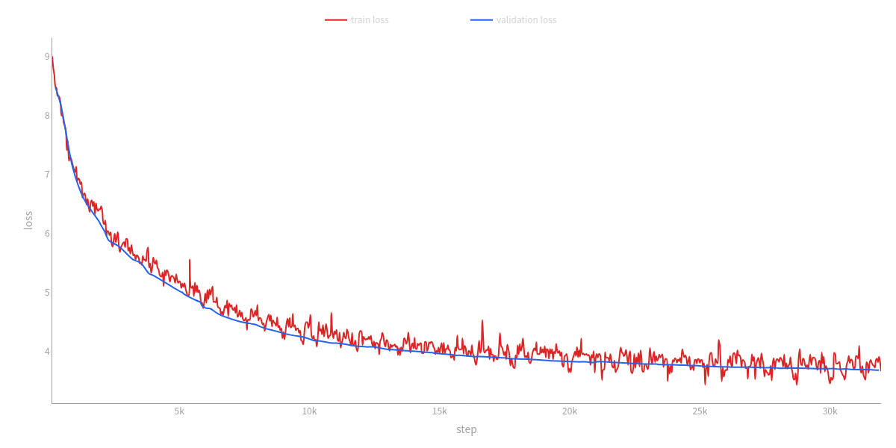
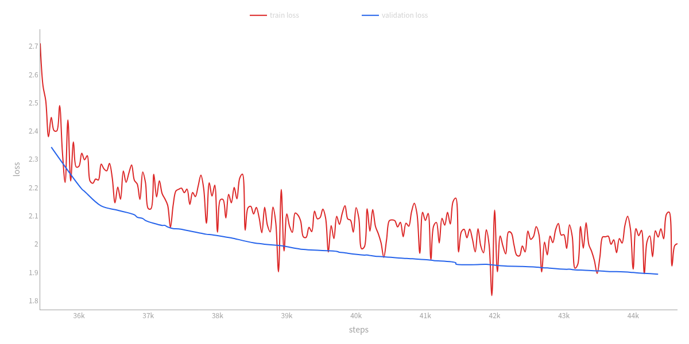

<div align="center">

```
        ▄
▀▀█▀▀   ▀               █     █▄ ▄█ ▄▀▀▀▄       █▀▀▀▀ ▄▀▀▀▄ █▄ ▄█
  █    ▀█   █▀▀▀▄ █   █ █     █ █ █ ▀   █       █▄▄▄  █ ▄▀█ █ █ █
  █     █   █   █ █   █ █     █   █   ▄▀  ▀▀▀▀▀     █ █▀  █ █   █
  █    ▄█▄  █   █ ▀▄▄▄█ █▄▄▄▄ █   █ ▄█▄▄▄       ▀▄▄▄▀ ▀▄▄▄▀ █   █
                   ▄▄▄▀
```

[](https://huggingface.co/Se00n00/TinyLM-2)
[](#)

[](#)
[](#)
[](#)

</div>

**TinyLM2-50M** is a compact decoder-only Transformer language model designed for efficient instruction following and conversational AI on edge devices, while also providing a lightweight platform for researching and understanding language-model behavior

---

## Model Architecture Overview [Architecture - Experimentations](experiments/EXPERIMENTS.md)

TinyLM leverages a pre-normalization architecture with gated feedforward networks

> The current architecture (below) uses **ALiBi** positional bias. The
> earlier release, **TinyLM-1-70M**, used a different attention design —
> **Naive-MHA** (plain multi-head attention, no ALiBi) — documented separately
> in [`experiments/naive_mha.md`](experiments/naive_mha.md). The benchmark
> tables in [Model Evaluation](#model-evaluation) below are all from the
> current **ALiBi**-based model.

```
-----------------------------------------------------------------------------------

 [OUTPUT]                                         Architecture: Alibi [Decoder-only transformer]
    │                                              .
    + ──────────┐                                   \_ [50M Parameters]
    |   ┌──────────────────────────┐               .
    │   |        FEEDFORWARD       │                \_ [512 D_model]
    │   └──────────────────────────┘               .
    |──[RMS-NORM]───┘                               \_ [12 Layers]
    + ──────────┐                                  .
    │   ┌──────────────────────────┐                \_ [2048 Context Length]
    │   |   MULTI-HEAD ATTENTION   + ──[ALiBi]     .
    │   └──────────────────────────┘                \_ [50271 Vocab Size]
    └──[RMS-NORM]───┘                              .
    │                                               \_ [Tied Word Embeddings]
 [INPUT]

-----------------------------------------------------------------------------------
```
---

## Navigation Menu

- [Model Architecture Overview](#model-architecture-overview)
- [Model Evaluation](#model-evaluation)
- [Deep-Dive Algorithmic Mechanics](#deep-dive-algorithmic-mechanics)
- [Installation & Data Preparation](#installation--data-preparation)
- [5-Stage Pipeline](#the-5-stage-llm-pipeline)
- [Streaming Inference](#asynchronous-streaming-inference)

---

## Model Evaluation

> **Note — current TinyLM2-50M results.** All tables below (Pretraining,
> Instruction-Tuned, and Reasoning) are from the current **ALiBi**-based
> architecture described above, produced with `lm-eval` under the same
> conditions used for every reference model. Raw logs live under
> [`eval_standard/`](eval_standard/). The earlier TinyLM-1-70M (Naive-MHA)
> baseline is documented in
> [`experiments/naive_mha.md`](experiments/naive_mha.md).

All benchmark evaluations below were executed using `lm-evaluation-harness` (`lm-eval`). For every reference model listed, we evaluated them ourselves using `lm-eval` under identical evaluation conditions to ensure direct, fair, and reproducible comparison with **TinyLM2-50M**.

### 1. Pre-Training (PT)

#### Training Details

```
Training Informations:
| Dataset -- [HuggingFaceFW/fineweb-edu (`sample-100BT`), Salesforce/wikitext (`wikitext-2-v1`)]
| Total tokens -- [4,000,000,000 (4B)]
| Sequence length -- [2,048 tokens]

| Epochs -- 1
| Per-device batch size -- 2 
| Gradient accumulation steps -- 16 
| Effective batch size -- 32 × 2,048 tokens 
| Learning rate -- 1e-4
| LR scheduler -- Cosine 
| Warmup ratio -- 1% 
| Weight decay -- 0.1 
| Precision -- float16 
| Hardware -- NVIDIA Tesla T4 x 2 GPU 
```

---

#### Training / Validation Loss


<div align="center">train vs validation loss</div>

---

#### Benchmark Results

Comparative zero-shot and few-shot evaluation results for pretrained base models:

| Category | Benchmark Task (Metric) | TinyLM2-50M (Base, 50M) | GPT-2 (Base, 124M)* | Supra-50M (Base, 50M)* | SmolLM2-135M (Base, 135M)* |
| :--- | :--- | :---: | :---: | :---: | :---: |
| **Commonsense & Logic** | **HellaSwag** (AN*) | 0.2761 | 0.3114 | 0.3178 | **0.4322** |
| | **CommonsenseQA** (Acc*) | 0.1957 | 0.1957 | **0.1966** | 0.1933 |
| | **PiQA** (AN*) | 0.5930 | 0.6251 | 0.6208 | **0.6861** |
| | **Winogrande** (Acc*) | 0.4972 | 0.5162 | **0.5099** | 0.5304 |
| **Language Modeling** | **WikiText** (PPL* ↓) | 77.01 | 37.37 | 44.95 | **21.06** |
| **Linguistic & Syntax** | **BLiMP** (Acc*) | 0.7641 | **0.8215** | 0.7632 | 0.8007 |
| **Science & Domain Knowledge** | **ARC-Easy** (AN*) | 0.4150 | 0.3948 | 0.4600 | **0.5871** |
| | **ARC-Challenge** (AN*) | 0.2449 | 0.2270 | **0.2500** | 0.2952 |
| | **SciQ** (AN*) | 0.6010 | 0.6440 | 0.6810 | **0.7860** |
| | **MMLU** (57 subjects, Acc*) | 0.2295 | 0.2292 | 0.2301 | **0.2410** |

`* Short-form metric definitions:`
- **AN***: `acc_norm` (Length-normalized Accuracy)
- **Acc***: `acc` (Standard Raw Accuracy)
- **EM***: `exact_match` (Exact Match string accuracy)
- **PPL***: `word_perplexity` (Perplexity on test set; lower score indicates better language modeling)
- `*`: *Denotes reference models evaluated locally by us using `lm-eval`.*
- *GSM8K, TriviaQA, and OpenBookQA are not re-listed above — they were not part of the current TinyLM2-50M PT eval run (see [`eval_standard/`](eval_standard/)).*

#### Example Output

Raw next-token continuation (no chat template, temperature 0.8, top-p 0.9):

```text
Prompt: "Photosynthesis is the process by which"

Plants take up oxygen and use it to make energy. Plant leaves, flowers, and
even fruit can also convert carbon dioxide (CO2) into sugars. As you grow,
plants are able to store the carbon dioxide from their leaves and convert it
to sugars and carbohydrates. This is known as photosynthesis, and it is a
process that converts the carbon dioxide into a form of energy. …
```

---

### 2. Instruction Tuning (IFT)

#### Training Details

```
Training Informations:
| Dataset -- [HuggingFaceH4/ultrachat_200k (`train_sft` split)]
| Total examples -- [~207k (UltraChat 200k, 4 epochs)]
| Sequence length -- [2,048 tokens]

| Epochs -- 4
| Per-device batch size -- 2 
| Gradient accumulation steps -- 16 
| Effective batch size -- 32 × 2,048 tokens 
| Learning rate -- 6e-5
| LR scheduler -- Cosine 
| Warmup ratio -- 1% 
| Weight decay -- 0.1 
| Precision -- float16 
| Hardware -- NVIDIA Tesla T4 x 2 GPU 
```

---

#### Training / Validation Loss


<div align="center">train vs validation loss</div>

---

#### Benchmark Results

Comparative evaluation results for instruction-fine-tuned (IFT) models:

| Category | Benchmark Task (Metric) | TinyLM2-50M (Instruct, 50M) | Supra-50M-IFT (50M) | SmolLM2-135M (Instruct, 135M)* |
| :--- | :--- | :---: | :---: | :---: |
| **Commonsense & Logic** | **HellaSwag** (AN*) | 0.2731 | 0.2922 | **0.4031** |
| | **PiQA** (AN*) | 0.5947 | 0.5952 | **0.6725** |
| | **Winogrande** (Acc*) | 0.5036 | 0.5154 | **0.5280** |
| | **BoolQ** (Acc*) | — | **0.4205** | — |
| | **OpenBookQA** (AN*) | — | 0.2860 | **0.3280** |
| **Instruction Following** | **IFEval** (Acc*) | 0.1265 | — | **0.2990** |
| **Language Modeling** | **WikiText** (PPL* ↓) | 91.31 | — | **24.11** |
| **Linguistic & Syntax** | **BLiMP** (Acc*) | 0.7438 | — | **0.8039** |
| **Science & Domain Knowledge** | **ARC-Easy** (AN*) | 0.3708 | 0.4423 | **0.4571** |
| | **ARC-Challenge** (AN*) | 0.2415 | 0.2756 | **0.2858** |
| | **SciQ** (AN*) | 0.5390 | — | **0.6960** |
| | **MMLU** (57 subjects, Acc*) | 0.2291 | — | **0.2470** |

`* Short-form metric definitions:`
- **AN***: `acc_norm` (Length-normalized Accuracy)
- **Acc***: `acc` (Standard Raw Accuracy)
- **EM***: `exact_match` (Exact Match string accuracy)
- **PPL***: `word_perplexity` (Perplexity on test set; lower score indicates better language modeling)
- **`—`**: *Task not evaluated for that model. Supra-50M-IFT values are as reported by the model authors; the remaining reference models were evaluated locally by us using `lm-eval`.*
- *TinyLM2-50M-IFT IFEval reflects prompt strict: `0.0887`, inst strict: `0.1643`, avg: `0.1265`.*

Evaluation details and full raw output predictions are saved under the [Evaluation/](file:///run/media/se00n00/P/LittleParrot/GPT/Evaluation) directory (raw logged results under [`eval_standard/`](eval_standard/)).

#### Example Output

Chat-templated generation (temperature 0.8, top-p 0.9):

```text
User: Write a short poem about the ocean.

The ocean is alive with life,
As it floats in the waves,
A vast expanse of vastness,
A sight that cannot be matched,
A wonderland that awakens,
A place where the sun shines,
The sea, it sets.

The ocean is a reminder of life,
The endless ocean, a place of peace,
A place where the sun shines,
The ocean is a beacon of hope,
A place where the ocean is alive …
```

---

### 3. Reasoning (RFT)

Reasoning-routed benchmarks for the reasoning fine-tuning checkpoint
(`TinyLM2-R1`, reported here as **TinyLM2-Reasoning**, fine-tuned on
reasoning traces) against the Supra-50M-Reasoning reference. Scores are
zero-shot; WikiText-2 is `word_perplexity` (lower is better).

#### Training Details

```
Training Informations:
| Dataset -- [Se00n00/reason_test (reasoning-trace Q&A pairs)]
| Sequence length -- [2,048 tokens]

| Epochs -- 6
| Per-device batch size -- 2 
| Gradient accumulation steps -- 16 
| Effective batch size -- 32 × 2,048 tokens 
| Learning rate -- 6e-5
| LR scheduler -- Cosine 
| Warmup ratio -- 1% 
| Weight decay -- 0.1 
| Precision -- float16 
| Hardware -- NVIDIA Tesla T4 x 2 GPU 
```

---

#### Benchmark Results

| Category | Benchmark | Metric | TinyLM2-Reasoning (50M) | Supra-50M-Reasoning (50M) |
| :--- | :--- | :--- | :---: | :---: |
| **Linguistics & Grammar** | **BLiMP** | Accuracy | **0.7613** | 0.6414 |
| **Commonsense & Reasoning** | **PIQA** | Normalized Accuracy | **0.5974** | 0.5947 |
| | **COPA** | Accuracy | **0.6100** | 0.5900 |
| | **WinoGrande** | Accuracy | 0.5036 | **0.5107** |
| | **BoolQ** | Accuracy | **0.6171** | 0.4606 |
| | **TruthfulQA MC2** | Accuracy | **0.4377** | 0.4255 |
| | **SWAG** | Normalized Accuracy | **0.4332** | 0.4233 |
| | **HellaSwag** | Normalized Accuracy | 0.2850 | **0.2916** |
| | **RACE** | Accuracy | **0.2909** | 0.2785 |
| | **CommonsenseQA** | Accuracy | 0.1957 | **0.2146** |
| **Academic & Knowledge** | **SciQ** | Normalized Accuracy | 0.5990 | **0.6410** |
| | **ARC-Easy** | Normalized Accuracy | 0.4091 | **0.4516** |
| | **OpenBookQA** | Normalized Accuracy | 0.2780 | **0.2880** |
| | **ARC-Challenge** | Normalized Accuracy | 0.2543 | **0.2654** |
| | **MMLU** | Accuracy | 0.2293 | **0.2358** |
| **Language Modeling** | **LAMBADA** | Accuracy | 0.1636 | **0.1653** |
| | **WikiText-2** | Word Perplexity (↓) | **111.19** | 166.27 |

- Supra-50M-Reasoning values are as reported by the model authors.
- Full raw output predictions are saved under
  [`Evaluation/RFT/`](file:///run/media/se00n00/P/LittleParrot/GPT/Evaluation/RFT) and
  [`eval_standard/`](eval_standard/).

#### Example Output

Chat-templated generation showing the model's thinking trace
(temperature 0.4, top-p 0.9, repetitive middle trimmed with `…`):

```text
User: A train travels 120 km in 2 hours. What is its average speed?

<|THINK|>
Okay, the user is asking about its average speed. Let me start by recalling
what I know. The average speed is when a train is traveling at a speed that's
higher than the speed of the train. So, the main factors are speed, speed, and
the train's speed.

First, the train's speed is the speed of the train itself. …
I should also note that the train's speed is the key factor, and to keep the
explanation concise.
<|/THINK|>

The average speed of the train is measured by its speed …
```

---

## The 5-Stage LLM Pipeline

TinyLM's training pipeline has grown from the original 2-stage (PT → SFT)
setup into five stages. The first four are implemented and runnable today
via `trainer/config.yaml`; **RLVR is the one stage still outstanding.**

| # | Stage | Pipeline Flag (`config.yaml`) | Description | Loss Metric | Status |
| :--- | :--- | :--- | :--- | :--- | :---: |
| 1 | **Pre-Training (PT)** | `PT` | Learns next-token probability distributions from raw corpora. | Standard Cross-Entropy | ✅ |
| 2 | **Supervised Fine-Tuning (SFT)** | `IFT` | Tunes the model on chat instructions; prompt/template tokens are masked out so loss only counts assistant-turn tokens. | Masked Cross-Entropy (`label_idx = -100`) | ✅ |
| 3 | **Reasoning Fine-Tuning** | `RFT` | Fine-tunes on chain-of-thought / reasoning-trace data. | Masked Cross-Entropy (`label_idx = -100`) | ✅ |
| 4 | **Tool Calling** | `TC` | Fine-tunes the model to emit structured tool/function calls against a supplied tool schema. | Masked Cross-Entropy (`label_idx = -100`) | ✅ |
| 5 | **RLVR** (Reinforcement Learning from Verifiable Rewards) | *not yet defined* | Reward-driven policy optimization against verifiable outcomes (e.g. checked math/code answers). | Policy-gradient objective | 🚧 **Remaining** — no pipeline flag or trainer support exists yet |

```
    ░▀█▀░▀█▀░█▀█░█░█░█░░░█▄█░░░▀█▀░█▀▄░█▀█░▀█▀░█▀█░█▀▀░█▀▄
    ░░█░░░█░░█░█░░█░░█░░░█░█░░░░█░░█▀▄░█▀█░░█░░█░█░█▀▀░█▀▄
    ░░▀░░▀▀▀░▀░▀░░▀░░▀▀▀░▀░▀░░░░▀░░▀░▀░▀░▀░▀▀▀░▀░▀░▀▀▀░▀░▀

```

TinyLM Trainer [TRAINER DOCS](trainer/TRAINER.md)

Define the pipeline order (stages 1–4) in `trainer/config.yaml`:

```yaml
pipeline:
  - PT
  - IFT
  - RFT
  - TC

dataset:
  PT:
    - base: "HuggingFaceFW/fineweb-edu"
      subset: "sample-10BT"
      split: train
      limit: 100 # 1000
      learning_rate: 3e-4
      text_column: text

  IFT:
    - base: "HuggingFaceH4/ultrachat_200k"
      subset: NULL
      split: train_sft
      limit: NULL
      learning_rate: 1e-4

  RFT:
    - base: "<your reasoning-trace dataset>"
      split: train
      limit: NULL
      learning_rate: 1e-4

  TC:
    - base: "<your tool-calling dataset>"
      split: train
      limit: NULL
      learning_rate: 1e-4
```

RLVR has no entry above yet — once it's wired into `trainer/`, it'll get its
own pipeline flag and a config block here.

```bash
python -m trainer.train \
  --training_name Train \
  --model Alibi \
  --batch_size 12 \
  --grad_accum_steps 16 \
  --eval_interval 100 \
  --validation_dataset_limit 2000 \
  --distributed ddp \  # if distributed
  --world_size 2 \  # number of gpu nodes
  --stream_dataset True --resume # for resuming training

```
---

## Asynchronous Streaming Inference

Test your trained model using the interactive streaming CLI. It runs sampling asynchronously and prints tokens in real-time:

```bash
python inference.py \
  --checkpoint checkpoints/TinyLM-1-70M_IFT.pt \
  --prompt "Explain the concept of neural networks in simple terms." \
  --temperature 0.7 \
  --top_k 40 \
  --top_p 0.9
```

## Evaluation

All evaluations run through `lm-evaluation-harness` (`lm_eval`). Export a checkpoint to a HF-loadable directory, then point `--model_args pretrained=...` at it:

```bash
lm_eval --model hf --model_args pretrained=./TinyLM2PT,trust_remote_code=True,max_length=512 --tasks hellaswag,piqa,arc_easy,sciq,mmlu --num_fewshot 0 --device cuda:0 --batch_size 8 --output_path Evaluation/PT
```

