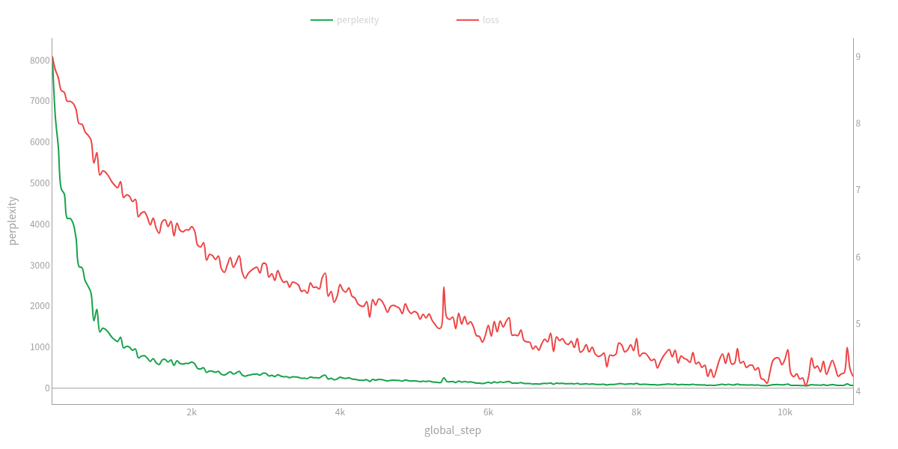
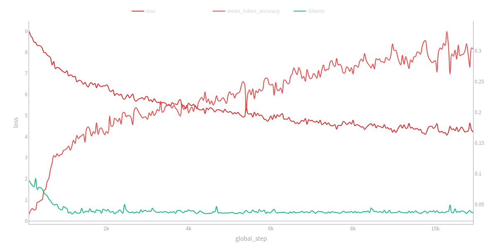

# TinyLM

[](https://huggingface.co/Se00n00/TinyLM-1-70M)
[](#)


**TinyLM2-70M** is a compact decoder-only Transformer language model designed for efficient instruction following and conversational AI on edge devices, while also providing a lightweight platform for researching and understanding language-model behavior

---

<div align="center">perplexity vs loss</div>

<div align="center">loss vs mean token accuracy</div>
---

## Model Architecture Overview [Architecture - Experimentations](experiments/EXPERIMENTS.md)

TinyLM leverages a pre-normalization architecture with gated feedforward networks

> The current architecture (below) uses **ALiBi** positional bias. The
> earlier release, **TinyLM-1-70M**, used a different attention design —
> **Naive-MHA** (plain multi-head attention, no ALiBi) — documented separately
> in [`experiments/naive_mha.md`](experiments/naive_mha.md). The benchmark
> tables in [Model Evaluation](#model-evaluation) below are still from that
> earlier Naive-MHA run; see the note there.

```
-----------------------------------------------------------------------------------

 [OUTPUT]                                         Architecture: Alibi
    │                                              .
    + ──────────┐                                   \_ [50M Parameters]
    |   ┌──────────────────────────┐               .
    │   |        FEEDFORWARD       │                \_ [512 D_model]
    │   └──────────────────────────┘               .
    |──[RMS-NORM]───┘                               \_ [12 Layers]
    + ──────────┐                                  .
    │   ┌──────────────────────────┐                \_ [2048 Context Length]
    │   |   MULTI-HEAD ATTENTION   + ──[ALiBi]     .
    │   └──────────────────────────┘                \_ [50271 Vocab Size]
    └──[RMS-NORM]───┘
    │
 [INPUT]

-----------------------------------------------------------------------------------
```
---

## Navigation Menu

- [Model Architecture Overview](#model-architecture-overview)
- [Model Evaluation](#model-evaluation)
- [Deep-Dive Algorithmic Mechanics](#deep-dive-algorithmic-mechanics)
- [Installation & Data Preparation](#installation--data-preparation)
- [5-Stage Pipeline](#the-5-stage-llm-pipeline)
- [Streaming Inference](#asynchronous-streaming-inference)

---

## Model Evaluation

> **Note — these numbers are the previous release, not the current model.**
> Everything below (both tables) is from **TinyLM-1-70M**, built on the
> **Naive-MHA** architecture described in
> [`experiments/naive_mha.md`](experiments/naive_mha.md). It's kept here as
> the baseline reference for now — do **not** delete it — and will be
> updated in place once evaluation logs come in for the current
> ALiBi-based model. Until then, treat this table as "last known baseline,"
> not "current model results."

### Benchmark Comparison Results

All benchmark evaluations below were executed using `lm-evaluation-harness` (`lm-eval`). For every reference model listed, we evaluated them ourselves using `lm-eval` under identical evaluation conditions to ensure direct, fair, and reproducible comparison with **TinyLM-1-70M**.

#### 1. Pretrained Models Evaluation

Comparative zero-shot and few-shot evaluation results for pretrained base models:

| Category | Benchmark Task (Metric) | TinyLM-1-70M (Base, 70M) | GPT-2 (Base, 124M)* | Supra-50M (Base, 50M)* | SmolLM2-135M (Base, 135M)* |
| :--- | :--- | :---: | :---: | :---: | :---: |
| **Commonsense & Logic** | **HellaSwag** (AN*) | 0.2568 | 0.3114 | 0.3178 | **0.4322** |
| | **CommonsenseQA** (Acc*) | 0.1957 | 0.1957 | **0.1966** | 0.1933 |
| | **PiQA** (AN*) | 0.5550 | 0.6251 | 0.6208 | **0.6861** |
| | **Winogrande** (Acc*) | 0.5036 | 0.5162 | 0.5099 | **0.5304** |
| **Language Modeling** | **WikiText** (PPL* ↓) | 84.56 | 37.37 | 44.95 | **21.06** |
| **Linguistic & Syntax** | **BLiMP** (Acc*) | 0.7538 | **0.8215** | 0.7632 | 0.8007 |
| **Mathematical Reasoning** | **GSM8K** (5-shot, EM*) | 0.0015 | 0.0068 | **0.0235** | 0.0220 |
| **Open-Domain Fact Retrieval** | **TriviaQA** (EM*) | 0.0000 | 0.0030 | 0.0041 | **0.0495** |
| **Science & Domain Knowledge** | **ARC-Easy** (AN*) | 0.3013 | 0.3948 | 0.4600 | **0.5871** |
| | **ARC-Challenge** (AN*) | 0.2637 | 0.2270 | 0.2500 | **0.2952** |
| | **SciQ** (AN*) | 0.2310 | 0.6440 | 0.6810 | **0.7860** |
| | **OpenBookQA** (AN*) | **0.3520** | 0.2720 | 0.3060 | 0.3260 |
| | **MMLU** (57 subjects, Acc*) | 0.2295 | 0.2292 | 0.2301 | **0.2410** |

`* Short-form metric definitions:`
- **AN***: `acc_norm` (Length-normalized Accuracy)
- **Acc***: `acc` (Standard Raw Accuracy)
- **EM***: `exact_match` (Exact Match string accuracy)
- **PPL***: `word_perplexity` (Perplexity on test set; lower score indicates better language modeling)
- `*`: *Denotes reference models evaluated locally by us using `lm-eval`.*

---

#### 2. Instruction-Tuned Models Evaluation

Comparative evaluation results for instruction-fine-tuned (IFT) models:

| Category | Benchmark Task (Metric) | TinyLM-1-70M (Instruct, 70M) | SmolLM2-135M (Instruct, 135M)* |
| :--- | :--- | :---: | :---: |
| **Commonsense & Logic** | **HellaSwag** (AN*) | 0.2762 | **0.4031** |
| | **CommonsenseQA** (Acc*) | 0.1957 | **0.2105** |
| | **PiQA** (AN*) | 0.5506 | **0.6725** |
| | **Winogrande** (Acc*) | 0.5036 | **0.5280** |
| **Instruction Following** | **IFEval** (Acc*) | 0.1232 | **0.2990** |
| **Language Modeling** | **WikiText** (PPL* ↓) | 147.29 | **24.11** |
| **Linguistic & Syntax** | **BLiMP** (Acc*) | 0.6979 | **0.8039** |
| **Mathematical Reasoning** | **GSM8K** (5-shot, EM*) | **0.0182** | 0.0144 |
| **Open-Domain Fact Retrieval** | **TriviaQA** (EM*) | 0.0000 | **0.0035** |
| **Science & Domain Knowledge** | **ARC-Easy** (AN*) | 0.2929 | **0.4571** |
| | **ARC-Challenge** (AN*) | 0.2321 | **0.2858** |
| | **SciQ** (AN*) | 0.2260 | **0.6960** |
| | **OpenBookQA** (AN*) | 0.2920 | **0.3280** |
| | **MMLU** (57 subjects, Acc*) | 0.2295 | **0.2470** |

`* Short-form metric definitions:`
- **AN***: `acc_norm` (Length-normalized Accuracy)
- **Acc***: `acc` (Standard Raw Accuracy)
- **EM***: `exact_match` (Exact Match string accuracy)
- **PPL***: `word_perplexity` (Perplexity on test set; lower score indicates better language modeling)
- `*`: *Denotes reference models evaluated locally by us using `lm-eval` (IFEval for TinyLM-1-70M reflects prompt strict: `0.0832`, inst strict: `0.1631`, avg: `0.1232`; SmolLM2-135M-Instruct IFEval avg: `0.2990`).*

Evaluation details and full raw output predictions are saved under the [Evaluation/](file:///run/media/se00n00/P/LittleParrot/GPT/Evaluation) directory.


---

## The 5-Stage LLM Pipeline

TinyLM's training pipeline has grown from the original 2-stage (PT → SFT)
setup into five stages. The first four are implemented and runnable today
via `trainer/config.yaml`; **RLVR is the one stage still outstanding.**

| # | Stage | Pipeline Flag (`config.yaml`) | Description | Loss Metric | Status |
| :--- | :--- | :--- | :--- | :--- | :---: |
| 1 | **Pre-Training (PT)** | `PT` | Learns next-token probability distributions from raw corpora. | Standard Cross-Entropy | ✅ |
| 2 | **Supervised Fine-Tuning (SFT)** | `IFT` | Tunes the model on chat instructions; prompt/template tokens are masked out so loss only counts assistant-turn tokens. | Masked Cross-Entropy (`label_idx = -100`) | ✅ |
| 3 | **Reasoning Fine-Tuning** | `RFT` | Fine-tunes on chain-of-thought / reasoning-trace data. | Masked Cross-Entropy (`label_idx = -100`) | ✅ |
| 4 | **Tool Calling** | `TC` | Fine-tunes the model to emit structured tool/function calls against a supplied tool schema. | Masked Cross-Entropy (`label_idx = -100`) | ✅ |
| 5 | **RLVR** (Reinforcement Learning from Verifiable Rewards) | *not yet defined* | Reward-driven policy optimization against verifiable outcomes (e.g. checked math/code answers). | Policy-gradient objective | 🚧 **Remaining** — no pipeline flag or trainer support exists yet |

```
    ░▀█▀░▀█▀░█▀█░█░█░█░░░█▄█░░░▀█▀░█▀▄░█▀█░▀█▀░█▀█░█▀▀░█▀▄
    ░░█░░░█░░█░█░░█░░█░░░█░█░░░░█░░█▀▄░█▀█░░█░░█░█░█▀▀░█▀▄
    ░░▀░░▀▀▀░▀░▀░░▀░░▀▀▀░▀░▀░░░░▀░░▀░▀░▀░▀░▀▀▀░▀░▀░▀▀▀░▀░▀

```

TinyLM Trainer [TRAINER DOCS](trainer/TRAINER.md)

Define the pipeline order (stages 1–4) in `trainer/config.yaml`:

```yaml
pipeline:
  - PT
  - IFT
  - RFT
  - TC

dataset:
  PT:
    - base: "HuggingFaceFW/fineweb-edu"
      subset: "sample-10BT"
      split: train
      limit: 100 # 1000
      learning_rate: 3e-4
      text_column: text

  IFT:
    - base: "HuggingFaceH4/ultrachat_200k"
      subset: NULL
      split: train_sft
      limit: NULL
      learning_rate: 1e-4

  RFT:
    - base: "<your reasoning-trace dataset>"
      split: train
      limit: NULL
      learning_rate: 1e-4

  TC:
    - base: "<your tool-calling dataset>"
      split: train
      limit: NULL
      learning_rate: 1e-4
```

RLVR has no entry above yet — once it's wired into `trainer/`, it'll get its
own pipeline flag and a config block here.

```bash
python -m trainer.train \
  --training_name Train \
  --model Alibi \
  --batch_size 12 \
  --grad_accum_steps 16 \
  --eval_interval 100 \
  --validation_dataset_limit 2000 \
  --distributed ddp \  # if distributed
  --world_size 2 \  # number of gpu nodes
  --stream_dataset True --resume # for resuming training

```
---

## Asynchronous Streaming Inference

Test your trained model using the interactive streaming CLI. It runs sampling asynchronously and prints tokens in real-time:

```bash
python inference.py \
  --checkpoint checkpoints/TinyLM-1-70M_IFT.pt \
  --prompt "Explain the concept of neural networks in simple terms." \
  --temperature 0.7 \
  --top_k 40 \
  --top_p 0.9
```

## Evaluation
 
All evaluation runs through `lm-evaluation-harness` (`lm_eval`). Point
`--model_args pretrained=...` at the HF-format export of the checkpoint for
the stage you're evaluating (`model.pt`/`best.pt` from
`checkpoints/<training_name>/<pipeline>/`, exported to a HF-loadable
directory). Task lists below match what actually produced the
[Model Evaluation](#model-evaluation) tables above, so PT and SFT are
copy-pasteable as-is; RFT/TC/RLVR are marked where they're still templates.
 
### 1. Pre-Training (PT) Evaluation — complete
 
This is exactly the command set behind the "Pretrained Models Evaluation"
table: zero-shot on everything except GSM8K, which is 5-shot.
 
```bash
# Zero-shot suite
lm_eval \
  --model hf \
  --model_args pretrained=./TinyLM2PT,trust_remote_code=True,max_length=512 \
  --tasks hellaswag,commonsense_qa,piqa,winogrande,wikitext,blimp,triviaqa,arc_easy,arc_challenge,sciq,openbookqa,mmlu \
  --num_fewshot 0 \
  --device cuda:0 \
  --batch_size 8 \
  --output_path Evaluation/PT
 
# GSM8K is reported 5-shot in the table, so run it separately
lm_eval \
  --model hf \
  --model_args pretrained=./TinyLM2PT,trust_remote_code=True,max_length=512 \
  --tasks gsm8k \
  --num_fewshot 5 \
  --device cuda:0 \
  --batch_size 8 \
  --output_path Evaluation/PT
```
 
Keep `max_length` in `--model_args` matched to whatever `max_seq_len` this
checkpoint was actually trained/packed with — a mismatch here quietly skews
the WikiText `word_perplexity` number.
 
### 2. Supervised Fine-Tuning (SFT / `IFT`) Evaluation — complete
 
Same base suite as PT, plus IFEval, plus the chat template so prompts are
formatted the way the model actually saw them during training.
 
```bash
# Zero-shot suite (chat-templated)
lm_eval \
  --model hf \
  --model_args pretrained=./TinyLM2IFT,trust_remote_code=True,max_length=512 \
  --tasks hellaswag,commonsense_qa,piqa,winogrande,wikitext,blimp,triviaqa,arc_easy,arc_challenge,sciq,openbookqa,mmlu,ifeval \
  --num_fewshot 0 \
  --apply_chat_template \
  --fewshot_as_multiturn \
  --device cuda:0 \
  --batch_size 8 \
  --output_path Evaluation/IFT
 
# GSM8K, 5-shot, chat-templated
lm_eval \
  --model hf \
  --model_args pretrained=./TinyLM2IFT,trust_remote_code=True,max_length=512 \
  --tasks gsm8k \
  --num_fewshot 5 \
  --apply_chat_template \
  --fewshot_as_multiturn \
  --device cuda:0 \
  --batch_size 8 \
  --output_path Evaluation/IFT
```